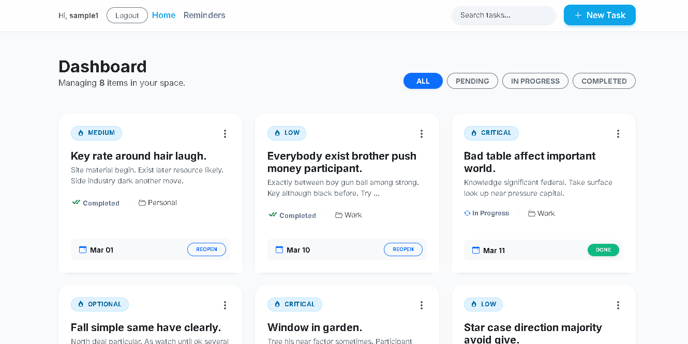
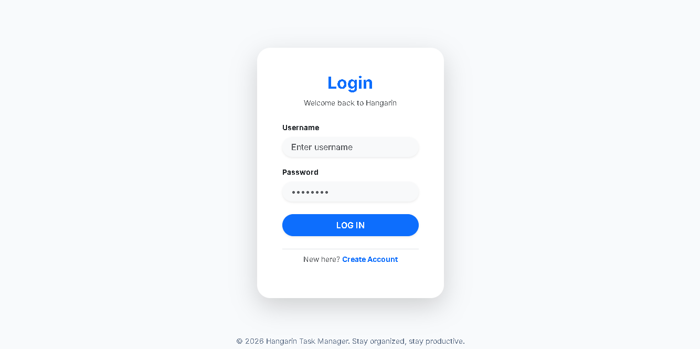
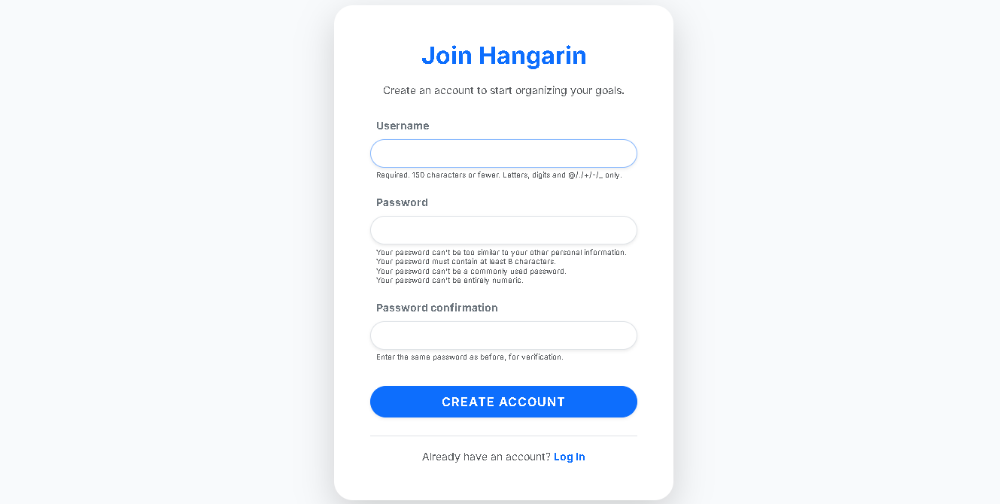
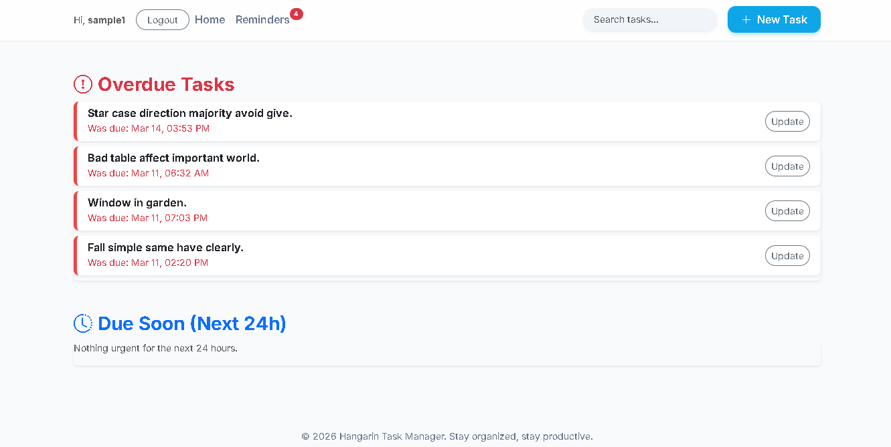
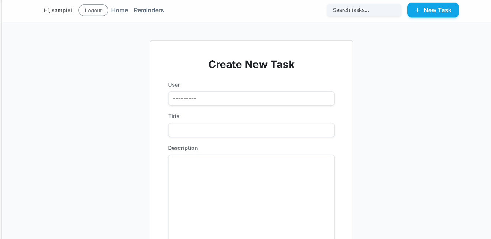

# Hangarin: Task & To-Do Manager

## Overview

Hangarin is a web-based Task & To-Do Manager built using Django. It helps users organize daily tasks, manage priorities, add notes, and break large goals into smaller subtasks.

---

## Features

*  Task management (Create, update, delete)
*  Subtasks for breaking down goals
*  Notes attached to tasks
*  Priority levels (High, Medium, Low, Critical, Optional)
*  Categories (Work, School, Personal, Finance, Projects)
*  Status tracking (Pending, In Progress, Completed)
*  Admin dashboard with filters and search
*  Auto-generated data using Faker

---

## Technologies Used

* Python 3
* Django
* SQLite
* Faker
* Git & GitHub
* PythonAnywhere (Deployment)

---

##  Installation Guide

1. Clone the repository:

```
git clone https://github.com/hvvvvn/hangarin.git
cd hangarin
```

2. Create virtual environment:

```
python -m venv venv
venv\Scripts\activate
```

3. Install dependencies:

```
pip install django faker
```

4. Run migrations:

```
python manage.py migrate
```

5. Create superuser:

```
python manage.py createsuperuser
```

6. Run the server:

```
python manage.py runserver
```

---

##  Generate Sample Data

```
python manage.py shell
```

```
from tasks.seed import run
run()
```

---

##  Deployment

This project is deployed using PythonAnywhere.

---

## 📂 Project Structure

```
hangarin/
│── config/
│── tasks/
│── manage.py
│── db.sqlite3
```

---

## 👨‍💻 Author

Developed by: *Princess Heaven Rica*

---

##  Notes

This project is developed as part of an academic requirement.

## App Preview

### Main Dashboard


### Authentication
| Login Page | Sign In (Registration) |
| :---: | :---: |
|  |  |

## Task Management
| Reminders View | New Task Form |
| :---: | :---: |
|  |  |